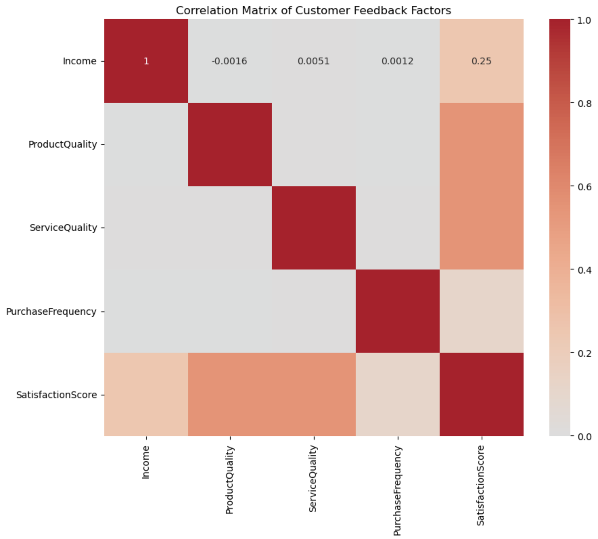
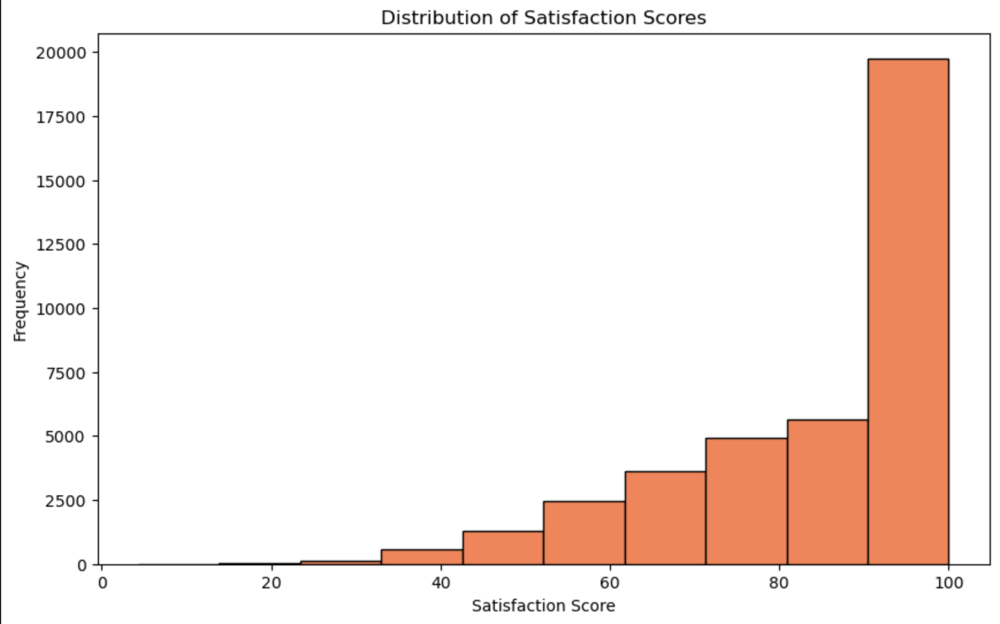

# Customer Satisfaction Analysis (Feedback) - PySpark Data Processing

## Project Overview
This project leverages PySpark to analyze and visualize customer feedback data, with a focus on satisfaction scores across different countries and loyalty levels. The analysis aims to derive insights into factors influencing customer satisfaction, using a combination of Spark SQL queries and PySpark DataFrame transformations. The project also includes CI/CD integration for testing, formatting, and deployment.

## Features
- **Data Loading**: Load and process a large dataset of customer feedback.
- **Spark SQL Queries**: Execute SQL queries on PySpark DataFrames to derive insights.
- **Data Transformations**: Apply transformations to compute and analyze various metrics.
- **Visualization**: Generate visualizations for correlation and distribution of satisfaction scores.
- **Logging**: Log outputs and visualizations to markdown for comprehensive reporting.

## Dataset
The dataset used in this project includes customer feedback with fields like:
- `CustomerID`
- `Age`
- `Gender`
- `Country`
- `Income`
- `ProductQuality`
- `ServiceQuality`
- `PurchaseFrequency`
- `FeedbackScore`
- `LoyaltyLevel`
- `SatisfactionScore`

This data allows for a multi-faceted analysis of customer satisfaction metrics across demographics and feedback variables.

## Analysis
### 1. Average Satisfaction by Country
Using Spark SQL, we calculate the average `SatisfactionScore` grouped by `Country`, allowing us to compare customer satisfaction levels across different regions. This provides insights into how satisfaction varies internationally and can help identify areas with higher or lower satisfaction.

### 2. Correlation Matrix of Key Variables
A correlation matrix is plotted for numerical columns such as `Income`, `ProductQuality`, `ServiceQuality`, `PurchaseFrequency`, and `SatisfactionScore`. This helps uncover relationships among these variables, giving insights into which factors might influence customer satisfaction the most.



### 3. Distribution of Satisfaction Scores
We plot a histogram to visualize the distribution of `SatisfactionScore` across all records, highlighting the overall customer satisfaction trend. This distribution reveals patterns and anomalies in customer satisfaction, which can further guide targeted improvements.



## Requirements
- **PySpark** for data processing
- **Matplotlib** and **Seaborn** for visualization
- **Python 3.7+**

## Installation

Clone the repository and install dependencies:
```bash
git clone https://github.com/your-repo/pyspark-data-processing
cd pyspark-data-processing
make install
```

## Usage 
Run the main script to process the data and generate outputs:

```bash
python main.py
```
This will:

- Set up the PySpark environment
- Load and process the data
- Execute the analysis steps
- Generate visualizations and log outputs in output_log.md

## Project Structure

```bash
.
├── .devcontainer
├── .github/workflows
│   └── cicd.yml
├── data
│   └── customer_feedback_satisfaction.csv
├── plots
├── pyspark_lib
│   └── __init__.py
├── .coverage
├── LICENSE
├── main.ipynb
├── main.py
├── Makefile
├── output_log.md
├── pyspark_lib.py
├── README.md
├── requirements.txt
└── test_main.py
```

## Makefile Commands
- install: Install all required dependencies.
- test: Run tests using pytest and generate coverage.
- unittest: Run unit tests using unittest.
- format: Format code using black.
- lint: Lint code using ruff.
- container-lint: Lint Dockerfile with hadolint.
- refactor: Run format and lint commands.
- deploy: Placeholder for deployment command.
- all: Run install, lint, test, format, and deploy.

## CI/CD Pipeline
The project includes a GitHub Actions CI/CD pipeline that:

Installs dependencies: Installs packages listed in requirements.txt.
Lints the code: Ensures code quality with ruff.
Runs tests: Executes unit tests with pytest.
Formats code: Applies black formatting.
Deploys: Runs deployment if on the main branch (deployment setup required).
Contribution
Feel free to contribute by opening issues or submitting pull requests. For major changes, please discuss them in advance.


Thank you for checking out this project! Happy coding! 😊